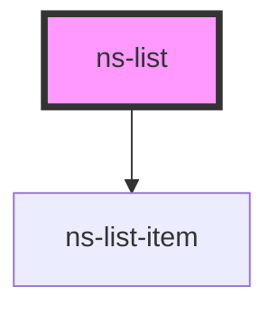

# ns-list

<!-- Auto Generated Below -->

## Properties

| Property | Attribute | Description | Type       | Default     |
| -------- | --------- | ----------- | ---------- | ----------- |
| `items`  | --        |             | `string[]` | `undefined` |

## Events

| Event         | Description | Type               |
| ------------- | ----------- | ------------------ |
| `listEmitted` |             | `CustomEvent<any>` |

## Dependencies

### Depends on

- [ns-list-item](../list-item)

### Graph

----------------------------------------------

*Built with [StencilJS](https://stenciljs.com/)*
